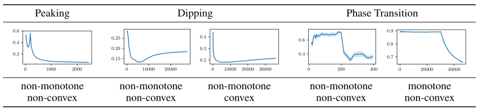
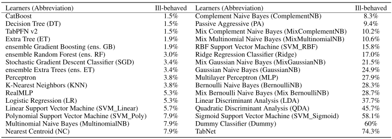

# LCDB 1.1: A Database Illustrating Learning Curves are more Ill-Behaved than Previously Thought

<p align="center">
  <a href="https://arxiv.org/abs/2505.15657" target="_blank"></a>
  <a href="https://doi.org/10.4121/3bd18108-fad0-4e4c-affd-4341fba99306" target="_blank"></a>
  <a href="https://neurips.cc/virtual/2025/poster/121511" target="_blank">
    
  </a>
</p>


```
📦 Project Root
├── 📂 analysis           — Analysis notebooks / Reproduce all figures from the paper
├── 📂 dataset            — The LCDB 1.1 datasets 
├── 📂 experiments        — Workflow for organising LCDB 1.1 computation
├── 📂 lcdb_function      — Functions for computing the learning curves
├── 📂 metadata           — Meta data about LCDB 1.1
└── LCDB11_demo.ipynb     - showing how to use our database
```

## Why LCDB 1.1 ?

#### Basic Characteristics
<div align="center">

| Database   | Data Acquisition             | Feature Scaling | Estimation Anchor               | Learner \| Dataset  |
|------------|--------------------------|-----------------|---------------------------------|----------------------|
| **LCDB 1.0**  | with data-leakage (dl)    | none              | ⌈ 16 ⋅ 2<sup>n/2</sup> ⌉               | 20 \| 196  |
| **LCDB 1.1**  | with and without dl   | none, min-max, standard        | 4 times denser                 | 32 \| 265    |

</div>

#### Ill-Behaved Learning Curves in the Wild
<p align="center">
  
</p>

#### More Ill-Behaved Than Previously Thought
<p align="center">
  
</p>

## How to use the LCDB 1.1? 
First download the precomputed learning curves from [4TU.ResearchData](https://doi.org/10.4121/3bd18108-fad0-4e4c-affd-4341fba99306) and extract them to the folder [dataset](./dataset/). Or you can use the demonstration in [`LCDB11_demo.ipynb`](./LCDB11_demo.ipynb) to download the data automatically. Useful metadata can be found in folder [metadata](./metadata/). 

Note, we recommend using learning curves from validation sets, since the sets differ in each inner and outer split, to ensure a no data-leakage version. The demostration can be found in [`LCDB11_demo.ipynb`](./LCDB11_demo.ipynb). 

## Contact us if you need more metrics!
We have stored all the probabilistic outputs and / or scores (when available for the learner). However, these files are too large for us to host for the broader public. If you are interested in a particular metric that we do not include, please contact us and we can compute it and host it. 

## License 
This work is licensed under a CC BY 4.0 - - Creative Commons Attribution 4.0 International License.
To view a copy of this license, visit [https://creativecommons.org/licenses/by/4.0/](https://creativecommons.org/licenses/by/4.0/). 

## Acknowledgement
This work is primarily based on the [OpenML](https://www.openml.org/) dataset platform and the [Scikit-learn](https://scikit-learn.org/stable/) library.


## Citation
If you find our work useful, please cite our paper: 

```bibtex
@article{yan2025lcdb,
  title={LCDB 1.1: A Database Illustrating Learning Curves Are More Ill-Behaved Than Previously Thought},
  author={Yan, Cheng and Mohr, Felix and Viering, Tom},
  journal={arXiv preprint arXiv:2505.15657},
  year={2025}
}